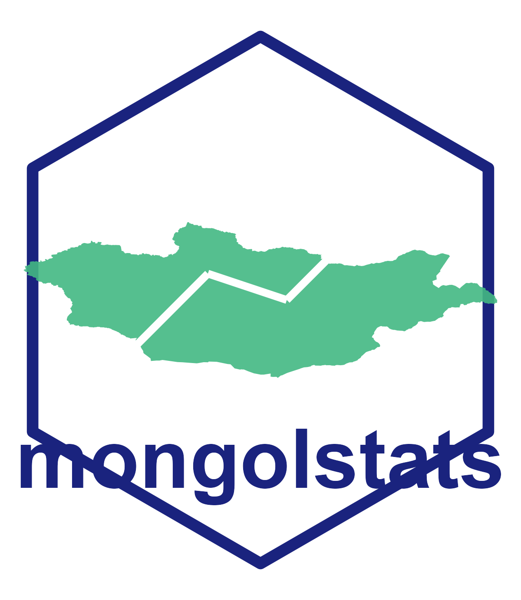

<!-- README.md is generated from README.Rmd. Please edit that file -->

```{r, include = FALSE}
knitr::opts_chunk$set(
  collapse = TRUE,
  comment = "#>",
  fig.path = "man/figures/README-",
  out.width = "100%"
)
```

# mongolstats 

<!-- badges: start -->
[](https://github.com/temuulene/mongolstats/actions/workflows/R-CMD-check.yaml)
[](https://lifecycle.r-lib.org/articles/stages.html#experimental)
<!-- badges: end -->

**mongolstats** is your gateway to the [National Statistics Office of Mongolia (NSO)](https://data.1212.mn/). Access official data, analyze economic trends, and map regional statistics—all from within R.

## Why mongolstats?

*   **Instant Access:** Query thousands of official datasets directly from R.
*   **Tidy Data:** Analysis-ready `tibble` format compatible with `dplyr` and `ggplot2`.
*   **Mapping Ready:** Built-in administrative boundaries for effortless geospatial analysis.
*   **Reliable:** Smart caching and robust error handling for smooth workflows.

## Installation

You can install the development version of mongolstats from [GitHub](https://github.com/) with:

```r
# install.packages("devtools")
devtools::install_github("temuulene/mongolstats")
```

## Quick Start

### 1. The Economic Pulse: GDP Trends

Visualize Mongolia's economic growth in seconds.

```{r gdp-example, eval=TRUE, message=FALSE, warning=FALSE}
library(mongolstats)
library(dplyr)
library(ggplot2)

# Set language to English
nso_options(mongolstats.lang = "en")

# Fetch GDP data - using labels for clarity
gdp <- nso_data(
  tbl_id = "DT_NSO_0500_001V1",
  selections = list(
    "Indicator" = "GDP, at current prices",
    "Economic activity" = "Total",
    "Year" = c(
      "2010", "2011", "2012", "2013", "2014",
      "2015", "2016", "2017", "2018", "2019",
      "2020", "2021", "2022", "2023"
    )
  ),
  labels = "en" # Get English labels
)

# Visualize
gdp |>
  ggplot(aes(x = as.integer(Year_en), y = value / 1e6)) + # Convert to Trillions
  geom_area(fill = "#42b883", alpha = 0.6) +
  geom_line(color = "#2c3e50", linewidth = 1.2) +
  geom_point(color = "#2c3e50", size = 3, shape = 21, fill = "white", stroke = 1.5) +
  scale_y_continuous(labels = scales::label_number(suffix = "T")) +
  scale_x_continuous(breaks = scales::pretty_breaks()) +
  labs(
    title = "Mongolia's GDP Growth (2010-2023)",
    subtitle = "Gross Domestic Product (in Trillions MNT)",
    x = NULL,
    y = NULL,
    caption = "Source: NSO Mongolia via mongolstats"
  ) +
  theme_minimal(base_size = 14) +
  theme(
    plot.title = element_text(face = "bold", size = 16),
    plot.subtitle = element_text(color = "grey40"),
    panel.grid.minor = element_blank(),
    panel.grid.major.x = element_blank()
  )
```

### 2. Mapping Regional Population

Discover how population is distributed across the country.

```{r pop-map-example, eval=TRUE, message=FALSE, warning=FALSE}
library(sf)

# 1. Fetch Population by Aimag
# Get all region codes first
regions <- nso_dim_values("DT_NSO_0300_002V1", "Region")$code

pop <- nso_data(
  tbl_id = "DT_NSO_0300_002V1",
  selections = list(
    "Region" = regions,
    "Year" = "2023" # Use the year label
  ),
  labels = "en" # Get English labels for joining
) |>
  filter(Region != "0") |> # Exclude National Total (code "0")
  mutate(Region_en = trimws(Region_en)) # Clean leading spaces in labels

# 2. Get Administrative Boundaries
map <- mn_boundaries(level = "ADM1")

# 3. Join and Map
map |>
  left_join(pop, by = c("shapeName" = "Region_en")) |>
  ggplot() +
  geom_sf(aes(fill = value), color = "white", size = 0.2) +
  scale_fill_viridis_c(
    option = "magma",
    direction = -1,
    labels = scales::label_number(scale_cut = scales::cut_short_scale()),
    name = "Population"
  ) +
  labs(
    title = "Population Distribution (2023)",
    subtitle = "Mid-year resident population by Aimag",
    caption = "Source: NSO Mongolia"
  ) +
  theme_void() +
  theme(
    plot.title = element_text(face = "bold", size = 16),
    plot.subtitle = element_text(color = "grey40"),
    legend.position = "bottom",
    legend.key.width = unit(1.5, "cm")
  )
```

## Documentation

Full documentation is available at [temuulene.github.io/mongolstats](https://temuulene.github.io/mongolstats/).

*   [Getting Started](https://temuulene.github.io/mongolstats/articles/getting-started.html) - Your first epidemiological analysis
*   [Discovery Guide](https://temuulene.github.io/mongolstats/articles/discovery.html) - Find and explore tables
*   [Mapping Guide](https://temuulene.github.io/mongolstats/articles/mapping.html) - Work with administrative boundaries

## Contributing

We welcome contributions! Please see the [Contributing Guidelines](CONTRIBUTING.md) for details.

## License

MIT
