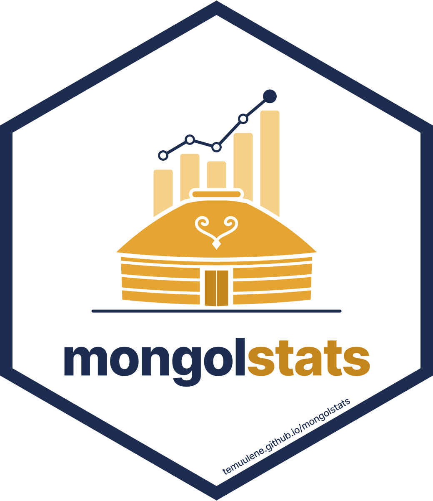

<!-- README.md is generated from README.Rmd. Please edit that file -->

```{r, include = FALSE}
knitr::opts_chunk$set(
  collapse = TRUE,
  comment = "#>",
  fig.path = "man/figures/README-",
  fig.width = 7,        # standardized width
  fig.height = 5,       # default height
  fig.dpi = 150,        # higher resolution for crisp rendering
  out.width = "100%"    # constrain to page width
)
```

# mongolstats 

<!-- badges: start -->
[](https://github.com/temuulene/mongolstats/actions/workflows/R-CMD-check.yaml)
[](https://lifecycle.r-lib.org/articles/stages.html#experimental)
<!-- badges: end -->

**mongolstats** is your gateway to the [National Statistics Office of Mongolia (NSO)](https://data.1212.mn/). Access official data, analyze economic trends, and map regional statistics—all from within R.

## Why mongolstats?

*   **Instant Access:** Query thousands of official datasets directly from R.
*   **Tidy Data:** Analysis-ready tibbles with English or Mongolian labels.
*   **Stable Periods:** Years and months come back as labels such as `"2024"` or `"2024-03"`, and can be selected in any NSO period format.
*   **Resilient:** Tables that NSO moves within its catalogue are found automatically, and large requests are split to stay within the server's limits.
*   **Mapping Ready:** Results join by NSO code to the maps in the companion package [mongolmaps](https://github.com/temuulene/mongolmaps).

## Installation

You can install mongolstats from CRAN with:

```r
install.packages("mongolstats")
```

Or install the development version, with mongolmaps for maps, from [GitHub](https://github.com/) with:

```r
# install.packages("pak")
pak::pak(c("temuulene/mongolstats", "temuulene/mongolmaps"))
```

## Quick Start

### 1. The Economic Pulse: GDP Trends

Find a table, then fetch it with selections written as codes or labels:

```{r gdp-example, eval=TRUE, message=FALSE, warning=FALSE}
library(mongolstats)
library(dplyr)
library(ggplot2)

nso_search("gross domestic product, by production approach") |>
  select(tbl_id, tbl_eng_nm)

gdp <- nso_data(
  tbl_id = "DT_NSO_0500_001V1",
  selections = list(
    "Statistical indicator" = "GDP, at current prices",
    "Economic activity" = "Total",
    Year = nso_period_seq("2010", "2025")
  )
)

# Years come back as labels, newest first; "2025*" marks a preliminary figure
head(gdp, 3)

gdp |>
  ggplot(aes(x = nso_period_date(Year), y = value / 1e6)) +
  geom_area(fill = "#42b883", alpha = 0.6) +
  geom_line(color = "#2c3e50", linewidth = 1.2) +
  geom_point(color = "#2c3e50", size = 3, shape = 21, fill = "white", stroke = 1.5) +
  scale_y_continuous(labels = scales::label_number(suffix = "T")) +
  labs(
    title = "Mongolia's GDP, 2010-2025",
    subtitle = "Gross domestic product at current prices (trillion MNT)",
    x = NULL,
    y = NULL,
    caption = "Source: NSO Mongolia via mongolstats"
  ) +
  theme_minimal(base_size = 12) +
  theme(
    plot.title = element_text(face = "bold", size = 16),
    plot.subtitle = element_text(color = "grey40"),
    panel.grid.minor = element_blank()
  )
```

### 2. Mapping Regional Population

NSO tables identify places by code. [mongolmaps](https://github.com/temuulene/mongolmaps) boundaries carry the same codes, so `mn_join()` attaches a table to the map in one step, keeping the aimags and dropping the national and regional totals:

```{r pop-map-example, eval=TRUE, message=FALSE, warning=FALSE}
library(mongolmaps)

pop_tbl <- "DT_NSO_0300_002V1"
latest <- nso_latest_periods(pop_tbl)

pop <- nso_data(pop_tbl, selections = list(Year = latest))

pop |>
  mn_join(by = "Region", level = "aimag") |>
  mn_map(fill = value, trans = "log10", title = paste("Population by aimag,", latest)) +
  labs(fill = "Population\n(log scale)")
```

## Documentation

Full documentation is available at [temuulene.github.io/mongolstats](https://temuulene.github.io/mongolstats/).

*   [Getting Started](https://temuulene.github.io/mongolstats/articles/getting-started.html) - Your first epidemiological analysis
*   [Discovery Guide](https://temuulene.github.io/mongolstats/articles/discovery.html) - Find and explore tables
*   [Mapping Guide](https://temuulene.github.io/mongolstats/articles/mapping.html) - Map NSO data with mongolmaps

## Contributing

We welcome contributions! Please see the [Contributing Guidelines](https://github.com/temuulene/mongolstats/blob/main/CONTRIBUTING.md) for details.

## License

MIT
