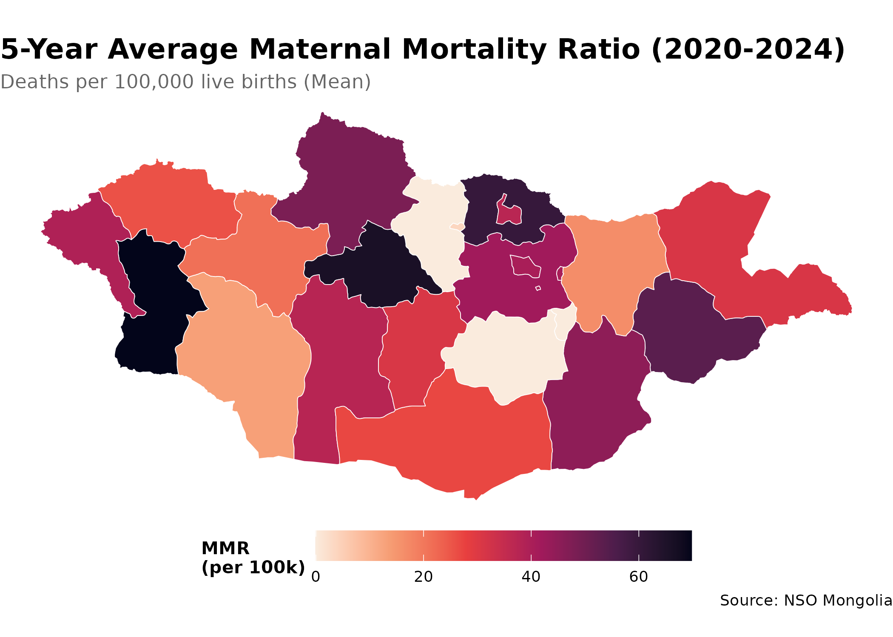
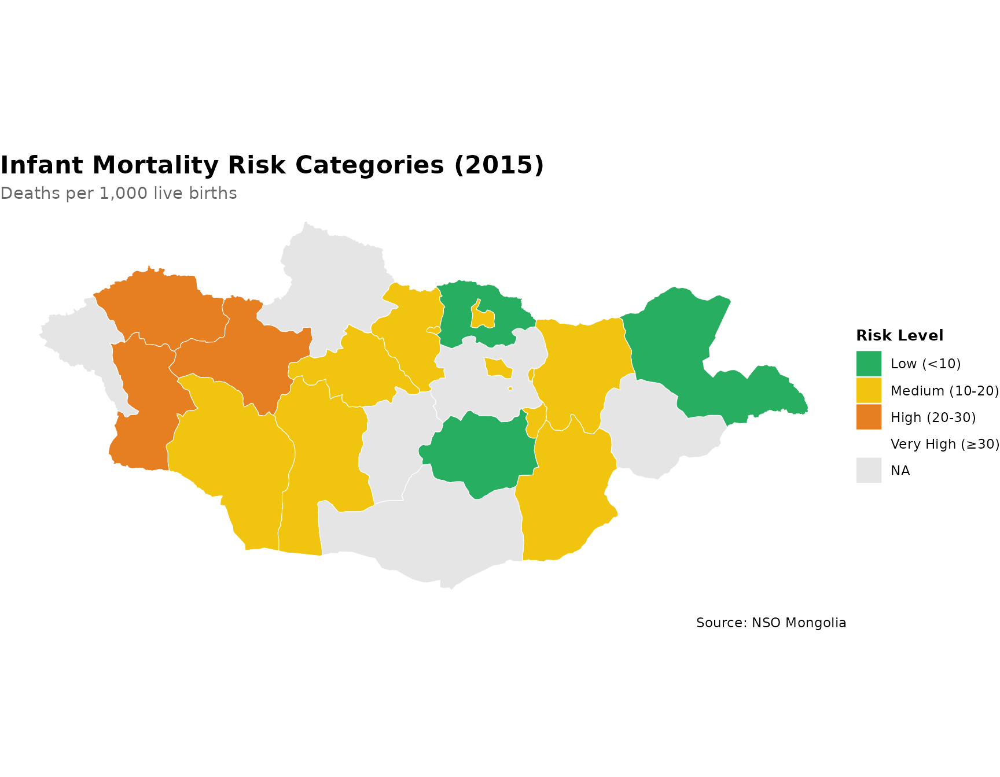

# Spatial Epidemiology with mongolstats

``` r
library(mongolstats)
library(sf)
library(dplyr)
library(ggplot2)
nso_options(mongolstats.lang = "en")

# Global theme with proper margins to prevent text cutoff
theme_set(
  theme_minimal(base_size = 11) +
    theme(
      plot.margin = margin(10, 10, 10, 10),
      plot.title = element_text(size = 13, face = "bold"),
      plot.subtitle = element_text(size = 10, color = "grey40"),
      legend.text = element_text(size = 9),
      legend.title = element_text(size = 10)
    )
)
```

## Overview

Geographic analysis is essential for understanding health disparities
and targeting interventions. This guide demonstrates spatial
epidemiology using Mongolia’s aimag-level (provincial) health data.

## Getting Boundary Data

Mongolia’s administrative boundaries are available at three levels:

``` r
# ADM0: National boundary
country <- mn_boundaries(level = "ADM0")

# ADM1: Aimags (21 provinces + Ulaanbaatar)
aimags <- mn_boundaries(level = "ADM1")

# ADM2: Soums (districts)
soums <- mn_boundaries(level = "ADM2")

# Quick preview
aimags |>
  ggplot() +
  geom_sf(fill = "white", color = "grey30", size = 0.3) +
  theme_void() +
  labs(title = "Mongolia's 21 Aimags + Ulaanbaatar")
```


## Case Study: Maternal Mortality Geography

### Understanding Regional Disparities

Maternal mortality is a critical indicator of health system performance
and equity.

``` r
# Fetch maternal mortality data for all aimags (2020-2024)
# We'll calculate a 5-year average to smooth out year-to-year variability
# This is important because small populations can have unstable rates

mmr_data <- nso_data(
  tbl_id = "DT_NSO_2100_050V1", # MMR per 100,000 live births
  selections = list(
    "Region" = nso_dim_values("DT_NSO_2100_050V1", "Region")$code,
    "Year" = as.character(2020:2024)
  ),
  labels = "en"
) |>
  filter(!Region %in% c("0", "1", "2", "3", "4", "511")) |> # Exclude Total, Regions, and duplicate UB
  mutate(
    Region_en = trimws(Region_en),
    # Standardize region names to match the geographic boundaries
    Region_en = dplyr::case_match(
      Region_en,
      "Bayan-Ulgii" ~ "Bayan-Ölgii",
      "Uvurkhangai" ~ "Övörkhangai",
      "Khuvsgul" ~ "Hovsgel",
      "Umnugovi" ~ "Ömnögovi",
      "Tuv" ~ "Töv",
      "Sukhbaatar" ~ "Sükhbaatar",
      .default = Region_en
    )
  ) |>
  # Calculate 5-year average to reduce random variation
  group_by(Region_en) |>
  summarise(value = mean(value, na.rm = TRUE), .groups = "drop")

# Preview data
mmr_data |>
  arrange(desc(value)) |>
  select(Region_en, value) |>
  head(10)
#> # A tibble: 10 × 2
#>    Region_en    value
#>    <chr>        <dbl>
#>  1 Khovd         70.4
#>  2 Arkhangai     65.9
#>  3 Selenge       60.7
#>  4 Sükhbaatar    54.0
#>  5 Hovsgel       48.4
#>  6 Dornogovi     45.3
#>  7 Töv           41.9
#>  8 Ulaanbaatar   40.4
#>  9 Bayan-Ölgii   39.1
#> 10 Bayankhongor  37.9
```

### Creating a Choropleth Map

``` r
# Join health data to geographic boundaries for spatial analysis
mmr_map <- aimags |>
  left_join(mmr_data, by = c("shapeName" = "Region_en"))

# Create choropleth map
p <- mmr_map |>
  ggplot() +
  geom_sf(aes(fill = value), color = "white", size = 0.2) +
  scale_fill_viridis_c(
    option = "rocket",
    direction = -1,  # dark = high mortality (concerning)
    name = "MMR\n(per 100k)",
    labels = scales::label_number()
  ) +
  labs(
    title = "5-Year Average Maternal Mortality Ratio (2020-2024)",
    subtitle = "Deaths per 100,000 live births (Mean)",
    caption = "Source: NSO Mongolia"
  ) +
  theme_void() +  # removes axes for clean map appearance
  theme(
    plot.title = element_text(face = "bold", size = 16),
    plot.subtitle = element_text(color = "grey40"),
    legend.position = "bottom",          # bottom legend maximizes map width
    legend.title = element_text(size = 10, face = "bold"),
    legend.key.width = unit(1.5, "cm")   # wider legend key for continuous scale
  )

p  # print static ggplot
```



## Case Study: Infant Mortality Hot Spots

### Identifying High-Risk Regions

``` r
# Get infant mortality rates
imr_tbl <- "DT_NSO_2100_015V1" # IMR per 1,000 live births (Monthly)

# Get metadata
months <- nso_dim_values(imr_tbl, "Month", labels = "en")
months_2024 <- months |>
  filter(grepl("2024", label_en)) |>
  pull(code)

imr_data <- nso_data(
  tbl_id = imr_tbl,
  selections = list(
    "Region" = nso_dim_values(imr_tbl, "Region")$code,
    "Month" = months_2024
  ),
  labels = "en"
) |>
  filter(nchar(Region) == 3) |> # Keep only Aimags and Ulaanbaatar
  mutate(
    Region_en = trimws(Region_en),
    Region_en = dplyr::case_match(
      Region_en,
      "Bayan-Ulgii" ~ "Bayan-Ölgii",
      "Uvurkhangai" ~ "Övörkhangai",
      "Khuvsgul" ~ "Hovsgel",
      "Umnugovi" ~ "Ömnögovi",
      "Tuv" ~ "Töv",
      "Sukhbaatar" ~ "Sükhbaatar",
      .default = Region_en
    )
  ) |>
  # Calculate annual average
  group_by(Region_en) |>
  summarise(value = mean(value, na.rm = TRUE), .groups = "drop") |>
  mutate(
    # Classify risk levels
    risk_category = case_when(
      value < 10 ~ "Low (<10)",
      value < 20 ~ "Medium (10-20)",
      value < 30 ~ "High (20-30)",
      TRUE ~ "Very High (≥30)"
    ),
    risk_category = factor(
      risk_category,
      levels = c("Low (<10)", "Medium (10-20)", "High (20-30)", "Very High (≥30)")
    )
  )

# Create risk category map
p <- aimags |>
  left_join(imr_data, by = c("shapeName" = "Region_en")) |>
  ggplot() +
  geom_sf(aes(fill = risk_category), color = "white", size = 0.2) +
  scale_fill_manual(
    values = c(
      "Low (<10)" = "#27ae60",       # green = good outcome
      "Medium (10-20)" = "#f1c40f",  # yellow = caution
      "High (20-30)" = "#e67e22",    # orange = concerning
      "Very High (≥30)" = "#c0392b"  # red = critical
    ),
    na.value = "grey90",  # missing data shown in light grey
    name = "Risk Level\n(IMR)",
    drop = FALSE  # show all levels even if not present in data
  ) +
  labs(
    title = "Infant Mortality Risk Categories (2024 Average)",
    subtitle = "Deaths per 1,000 live births",
    caption = "Source: NSO Mongolia"
  ) +
  theme_void() +
  theme(
    plot.title = element_text(face = "bold", size = 16),
    plot.subtitle = element_text(color = "grey40"),
    legend.position = "bottom",          # bottom legend maximizes map width
    legend.title = element_text(size = 10, face = "bold")
  )

p  # print static ggplot
```



## Tips for Spatial Epidemiology

1.  **Check data completeness**: Not all aimags may have data for all
    indicators
2.  **Use appropriate scales**: Choose color scales that highlight
    health disparities
3.  **Add context**: Include reference lines (e.g., national average)
    when relevant
4.  **Consider population size**: Normalize rates by population when
    comparing regions
5.  **Temporal analysis**: Create animated maps to show geographic
    trends over time

## Next Steps

- **Discover Health Data**: Return to the [Discovery
  Guide](https://temuulene.github.io/mongolstats/articles/discovery.md)
- **Learn More**: Explore all functions in the
  [Reference](https://temuulene.github.io/mongolstats/reference/index.html)
